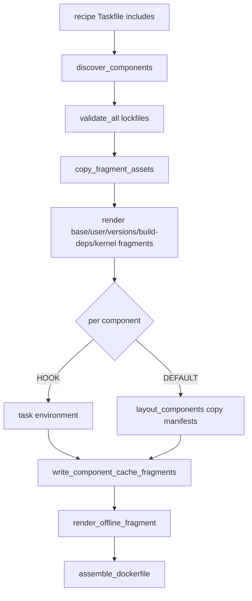

# dr-environment — Agent Guide

> Contributor documentation: this describes working **on** this repo, not using the environment it builds.

DataRobot CLI plugin that builds **Codespace-ready execution environment Docker contexts** for App Framework recipes (e.g. `datarobot-agent-application`). Output is a customer-buildable Wolfi image with pre-warmed **uv**, **npm**, and **Go** caches for offline use in DataRobot notebooks.

## Quick commands

```bash
# Dev setup
uv pip install -e ".[dev]"
pytest

# Plugin manifest (required for dr CLI discovery)
dr-environment --dr-plugin-manifest

# Generate docker context from a recipe
dr environment recipe --recipe-path /path/to/datarobot-agent-application

# Build the image (always amd64)
cd docker_context
docker build --platform linux/amd64 -t exec-env .
```

## What this repo does

`dr environment recipe` takes an App Framework recipe and writes a `docker_context/` directory:

1. Discovers components from the recipe root `Taskfile.yml` `includes`
2. Validates lockfiles (fail-fast on missing/stale)
3. Copies per-component manifests into `components/<name>/` (no dependency merging)
4. Renders Dockerfile fragments (base → user → versions → build-deps → kernel → per-component cache stages → offline)
5. Assembles `Dockerfile` from sorted `dockerfile.d/*.fragment`
6. Optionally creates `docker_context.tar.gz` in the CWD

The generated image runs as the `notebooks` user, boots Jupyter Kernel Gateway, and sets strict offline env vars so `uv sync`, `npm ci`, and `go mod download` work from baked caches.

## Repository layout

```
src/dr_environment/
├── cli.py              # Click CLI; handles --dr-plugin-manifest before Click
└── recipe/
    ├── build.py        # Orchestrates the full docker context build
    ├── discover.py     # Parse recipe Taskfile includes → Component list
    ├── validate.py     # Lockfile checks (uv lock --check, npm ci --dry-run, go mod verify)
    ├── layout.py       # Copy manifests; strip local `core` package from pyproject.toml
    ├── hooks.py        # Run component `task environment` hooks
    ├── render.py       # Jinja templates + asset copy + Dockerfile assembly
    ├── versions.py     # Read recipe versions.yaml; defaults for unlisted tools
    ├── manifests.py    # Locate a component's manifest files
    ├── models.py       # Component, Ecosystem, ComponentStrategy enums
    └── cache/
        └── stages.py   # Generate per-component Dockerfile cache fragments

src/dr_environment/recipe/templates/docker_context/
├── 00-base.fragment.j2       # Wolfi base (digest-pinned) + CPython apk layers
├── 01-user.fragment.j2       # `notebooks` user, uid/gid 10101
├── 02-versions.fragment.j2   # uv, task, node, dr CLI, Pulumi, opencode, Agent Assist
├── 03-build-deps.fragment.j2 # Build-time dependency manifests
├── 04-kernel.fragment.j2     # Kernel venv, Jupyter assets, runtime scripts
├── 99-offline.fragment.j2    # cache-perms stage, offline env vars, model entrypoint
├── kernel/requirements.txt   # Kernel-only deps (NOT recipe component deps)
└── build-deps/, kernel/      # render.py:FRAGMENT_ASSET_DIRS, copied in as directories

tests/                  # pytest unit tests (no Docker integration tests yet)
```

## Build pipeline



### Component strategies

| Strategy | When | Behavior |
|----------|------|----------|
| `DEFAULT` | Has `pyproject.toml`, `package.json`, or `go.mod` | Copy manifests + generate cache stage |
| `HOOK` | Component Taskfile defines `environment` task | Skip default copy/cache; hook writes fragment |
| `SKIP` | No manifests and no hook | Ignored |

### Dockerfile stage chain

```
wolfi_python_dev → base → user → versions → build-deps → kernel
  → cache-<component1> → … → cache-perms;  offline is FROM kernel + COPY --from=cache-perms
```

Fragments are named `{component.fragment_order:02d}-cache-{name}.fragment` and concatenated in sorted order between `04-kernel` and `99-offline`.

## Design constraints (do not violate)

### No dependency merging

Never parse or merge component `pyproject.toml` files. Each component's manifests are copied verbatim into `docker_context/components/<name>/`. Conflicting pins across components are fine — each gets its own venv at runtime; the shared cache holds all needed wheels.

### Kernel vs component deps

- **Kernel**: `kernel/requirements.txt`, a flat pinned list for Jupyter/Kernel Gateway only. Installed in the `kernel` stage (`04-kernel.fragment.j2`) into `/etc/system/kernel/.venv`. No root `pyproject.toml` in docker context.
- **Components**: each has its own `pyproject.toml` + `uv.lock` under `components/<name>/`.

### Local `core` package convention

Recipes symlink a shared `core/` Python package. When copying non-`core` components:

- `layout.strip_local_shared_python_package()` removes `"core"` from dependencies and `core = { path = "core" }` from `[tool.uv.sources]`
- Cache stages use `--no-install-package core` so the local editable package is not built during cache warm (only third-party deps are cached)

The `core` component itself is copied and cached normally.

### Cache warming must use `uv sync`, not `uv pip install`

**Critical:** `uv export` + `uv pip install` populates wheels but **does not** satisfy `uv sync --offline` at runtime (lockfile-specific platform wheels like `litellm` cp311-manylinux fail).

Cache stages must use:

```dockerfile
uv sync --frozen --no-install-project --all-extras --all-groups \
    --python ${VENV_PATH}/bin/python
```

With `--no-install-package core` for non-core components. Do **not** use `uv pip download` (does not exist). Do **not** add `--python-platform`.

### Platform: always linux/amd64

DataRobot notebook kernels run on **linux/amd64**. The base template builds `FROM --platform=${TARGETPLATFORM}`, which `render.py` sets to `linux/amd64`. Users on Apple Silicon must pass `--platform linux/amd64` when building. An arm64 image fails with `exec format error` on `start_server.sh`.

### Offline runtime

The final `offline` stage (`99-offline.fragment.j2`) sets:

```
UV_OFFLINE=1
NPM_CONFIG_OFFLINE=true
GOPROXY=off
```

Caches live at `/opt/cache/uv`, `/opt/cache/npm`, `/opt/cache/go/`. `setup-caches.sh` re-exports these for login shells; `NOTEBOOKS_AIR_GAP=1` applies the same offline overrides.

### versions.yaml integration

Recipe `.datarobot/cli/versions.yaml` drives:

- `dr` CLI version (`02-versions.fragment.j2` → `CLI_VERSION`)
- `pulumi` version (the `versions` stage installs via `get.pulumi.com`)

`versions.py` falls back to `_DEFAULTS` for anything a recipe does not list. The `versions` stage installs `uv` and `task` from their upstream install scripts and `node` and the `dr` CLI from release tarballs; of these tools only `git` comes from a Wolfi apk (`02-versions`; the `00-base` toolchain layer already pulls it in).

### COPY ownership in cache stages

Cache stage `COPY` uses `--chown=notebooks:notebooks` because cache stages build `FROM kernel`, and the `kernel` stage ends with `USER $UNAME` (`notebooks`). Without this, cache writes fail with permission denied.

## Key files to edit

| Change | File(s) |
|--------|---------|
| CLI options / entrypoint | `src/dr_environment/cli.py` |
| Build orchestration | `recipe/build.py` |
| Python/npm/go cache Dockerfile lines | `recipe/cache/stages.py` |
| Wolfi base image, apk layers | `recipe/templates/docker_context/00-base.fragment.j2` |
| dr CLI, Pulumi, tool versions | `recipe/templates/docker_context/02-versions.fragment.j2` |
| Kernel venv, Jupyter assets | `recipe/templates/docker_context/04-kernel.fragment.j2` |
| Offline env, cache perms, model entrypoint | `recipe/templates/docker_context/99-offline.fragment.j2` |
| Kernel Jupyter deps | `recipe/templates/docker_context/kernel/requirements.txt` |
| Runtime shell scripts | `recipe/templates/docker_context/kernel/` |
| `core` stripping logic | `recipe/layout.py` |
| Lockfile validation rules | `recipe/validate.py` |
| Component discovery | `recipe/discover.py` |
| Hook env contract | `recipe/hooks.py` |

## Testing

```bash
uv pip install -e ".[dev]"
pytest
dr-environment --dr-plugin-manifest
```

Test against a real recipe:

```bash
cd /path/to/datarobot-agent-application
uv run dr-environment recipe --recipe-path . --no-tarball
ls docker_context/dockerfile.d/
grep -E "uv sync|UV_OFFLINE" docker_context/Dockerfile
```

There are no Docker build integration tests in CI yet. Manually verify with `docker build --platform linux/amd64`.

## Common pitfalls

| Symptom | Cause | Fix |
|---------|-------|-----|
| `exec format error` on `start_server.sh` | arm64 image on amd64 cluster | Rebuild with `--platform linux/amd64` |
| `Missing required tools: Pulumi` | Pulumi not in image | Ensure `versions.yaml` has `pulumi.minimum-version`; the `versions` stage installs it |
| `Failed to download litellm` with `UV_OFFLINE=1` | Cache warmed with `uv pip install` instead of `uv sync` | Use `uv sync --frozen --no-install-project` in cache stages |
| `sed: setup-ssh.sh: No such file` in Docker build | CRLF `sed` runs before scripts are COPY'd | Run `sed` after all shell script COPYs |
| Cache permission denied | COPY as root, RUN as notebooks | Use `COPY --chown=notebooks:notebooks` |
| `-e ./core` breaks pip install | Workspace `core` in exported requirements | Strip `core` from copied pyproject + `--no-install-package core` |

## Component hook contract

When a component Taskfile defines `environment`, `hooks.py` runs `task environment` with:

| Variable | Purpose |
|----------|---------|
| `DOCKER_CONTEXT` | Output docker context path |
| `COMPONENT_DIR` | Source component directory |
| `COMPONENT_NAME` | Component name |
| `DOCKERFILE_FRAGMENT` | Path to append cache stage fragment |
| `COMPONENT_DEST` | `components/<name>/` in docker context |

The hook is responsible for copying files and appending its Dockerfile fragment.

## Reference implementations

- **Base image**: public `cgr.dev/chainguard/wolfi-base`
- **Wolfi apk layers**: [datarobot-user-models](https://github.com/datarobot/datarobot-user-models) `public_dropin_notebook_environments/python313_notebook/Dockerfile`
- **Vendored `kernel/` scripts**: same repo, `public_dropin_environments/python311_genai_agents/`
- **Application devcontainer** (Pulumi, `dr` CLI patterns): [datarobot-agent-application](https://github.com/datarobot-community/datarobot-agent-application) `.devcontainer/Dockerfile`
- **versions.yaml tool checks**: the application's `.datarobot/cli/versions.yaml`

## Coding style

- Keep changes minimal and focused; match existing module boundaries
- Add tests in `tests/` for new logic (render output, layout transforms, cache fragment content)
- Do not add a root `pyproject.toml` to docker context output
- Do not merge or parse component dependencies across components
- Comments only for non-obvious business logic
- Bump `[project].version` in `pyproject.toml` when changing what ships, and file the `CHANGELOG.md` entry under that version
- Run `pytest` before finishing

## Plugin integration

Registered as DataRobot CLI plugin `environment`:

```bash
uv tool install .
dr plugin list          # should show environment
dr environment recipe --recipe-path .
```

Manifest is emitted via `dr-environment --dr-plugin-manifest` (handled in `cli.main()` before Click parses args).
