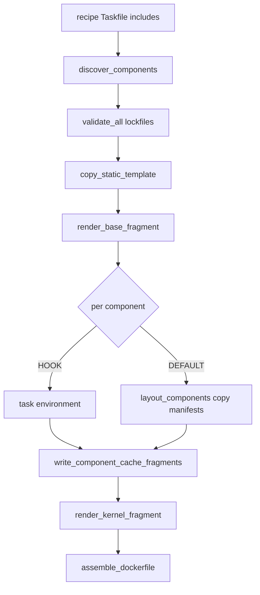

# dr-environment — Agent Guide

DataRobot CLI plugin that builds **Codespace-ready execution environment Docker contexts** for App Framework recipes (e.g. `datarobot-agent-application`). Output is a customer-buildable Wolfi image with pre-warmed **uv**, **npm**, and **Go** caches for offline use in DataRobot notebooks.

## Quick commands

```bash
# Dev setup
uv pip install -e ".[dev]"
pytest

# Plugin manifest (required for dr CLI discovery)
dr-environment --dr-plugin-manifest

# Generate docker context from a recipe
dr environment recipe --recipe-path /path/to/datarobot-agent-application

# Build the image (always amd64)
cd docker_context
docker build --platform linux/amd64 -t exec-env .
```

## What this repo does

`dr environment recipe` takes an App Framework recipe and writes a `docker_context/` directory:

1. Discovers components from the recipe root `Taskfile.yml` `includes`
2. Validates lockfiles (fail-fast on missing/stale)
3. Copies per-component manifests into `components/<name>/` (no dependency merging)
4. Renders Dockerfile fragments (base → per-component cache stages → kernel)
5. Assembles `Dockerfile` from sorted `dockerfile.d/*.fragment`
6. Optionally creates `docker_context.tar.gz` in the CWD

The generated image runs as the `notebooks` user, boots Jupyter Kernel Gateway, and sets strict offline env vars so `uv sync`, `npm ci`, and `go mod download` work from baked caches.

## Repository layout

```
src/dr_environment/
├── cli.py              # Click CLI; handles --dr-plugin-manifest before Click
├── build.py            # Orchestrates the full docker context build
├── discover.py         # Parse recipe Taskfile includes → Component list
├── validate.py         # Lockfile checks (uv lock --check, npm ci --dry-run, go mod verify)
├── layout.py           # Copy manifests; strip local `core` package from pyproject.toml
├── hooks.py            # Run component `task environment` hooks
├── render.py           # Jinja templates + static copy + Dockerfile assembly
├── models.py           # Component, Ecosystem, ComponentStrategy enums
└── cache/
    └── stages.py       # Generate per-component Dockerfile cache fragments

src/dr_environment/templates/docker_context/
├── 00-base.fragment.j2       # Wolfi base + kernel venv + runtime scripts
├── 99-kernel.fragment.j2     # dr CLI, Pulumi, opencode, offline env vars
├── kernel/requirements.txt   # Kernel-only deps (NOT recipe component deps)
└── static/                   # Copied verbatim into docker_context root

tests/                  # pytest unit tests (no Docker integration tests yet)
```

## Build pipeline



### Component strategies

| Strategy | When | Behavior |
|----------|------|----------|
| `DEFAULT` | Has `pyproject.toml`, `package.json`, or `go.mod` | Copy manifests + generate cache stage |
| `HOOK` | Component Taskfile defines `environment` task | Skip default copy/cache; hook writes fragment |
| `SKIP` | No manifests and no hook | Ignored |

### Dockerfile stage chain

```
wolfi_python_dev → base → cache-<component1> → cache-<component2> → … → kernel
```

Fragments are named `{order:02d}-cache-{name}.fragment` and concatenated in sorted order with `00-base` and `99-kernel`.

## Design constraints (do not violate)

### No dependency merging

Never parse or merge component `pyproject.toml` files. Each component's manifests are copied verbatim into `docker_context/components/<name>/`. Conflicting pins across components are fine — each gets its own venv at runtime; the shared cache holds all needed wheels.

### Kernel vs component deps

- **Kernel**: `kernel/requirements.txt` — flat pinned list for Jupyter/Kernel Gateway only. Installed in base stage venv (`/etc/system/kernel/.venv`). No root `pyproject.toml` in docker context.
- **Components**: each has its own `pyproject.toml` + `uv.lock` under `components/<name>/`.

### Local `core` package convention

Recipes symlink a shared `core/` Python package. When copying non-`core` components:

- `layout.strip_local_shared_python_package()` removes `"core"` from dependencies and `core = { path = "core" }` from `[tool.uv.sources]`
- Cache stages use `--no-install-package core` so the local editable package is not built during cache warm (only third-party deps are cached)

The `core` component itself is copied and cached normally.

### Cache warming must use `uv sync`, not `uv pip install`

**Critical:** `uv export` + `uv pip install` populates wheels but **does not** satisfy `uv sync --offline` at runtime (lockfile-specific platform wheels like `litellm` cp312-manylinux fail).

Cache stages must use:

```dockerfile
uv sync --frozen --no-install-project --python-platform x86_64-manylinux_2_28 \
    --python ${VENV_PATH}/bin/python
```

With `--no-install-package core` for non-core components. Do **not** use `uv pip download` (does not exist).

### Platform: always linux/amd64

DataRobot notebook kernels run on **linux/amd64**. The base template pins `FROM --platform=linux/amd64`. Users on Apple Silicon must pass `--platform linux/amd64` when building. An arm64 image fails with `exec format error` on `start_server.sh`.

`PYTHON_PLATFORM = "x86_64-manylinux_2_28"` in `cache/stages.py` must stay aligned with the image platform.

### Offline runtime

The kernel stage sets:

```
UV_OFFLINE=1
NPM_CONFIG_OFFLINE=true
GOPROXY=off
```

Caches live at `/opt/cache/uv`, `/opt/cache/npm`, `/opt/cache/go/`. `setup-caches.sh` re-exports these for login shells; `NOTEBOOKS_AIR_GAP=1` applies the same offline overrides.

### versions.yaml integration

Recipe `.datarobot/cli/versions.yaml` drives:

- `dr` CLI version (base/kernel template → `CLI_VERSION`)
- `pulumi` version (kernel stage installs via `get.pulumi.com`)

Other tools in `versions.yaml` (`uv`, `node`, `git`, `task`) are validated by `dr self check` at runtime. Base image installs them via Wolfi packages (`apk add task uv nodejs npm git`). If version mismatches appear, pin from `versions.yaml` explicitly.

### COPY ownership in cache stages

Cache stage `COPY` uses `--chown=notebooks:notebooks` because the base stage ends with `USER notebooks`. Without this, cache writes fail with permission denied.

## Key files to edit

| Change | File(s) |
|--------|---------|
| CLI options / entrypoint | `src/dr_environment/cli.py` |
| Build orchestration | `src/dr_environment/build.py` |
| Python/npm/go cache Dockerfile lines | `src/dr_environment/cache/stages.py` |
| Wolfi base image, kernel venv, scripts | `templates/docker_context/00-base.fragment.j2` |
| dr CLI, Pulumi, offline env | `templates/docker_context/99-kernel.fragment.j2` |
| Kernel Jupyter deps | `templates/docker_context/kernel/requirements.txt` |
| Runtime shell scripts | `templates/docker_context/static/` |
| `core` stripping logic | `src/dr_environment/layout.py` |
| Lockfile validation rules | `src/dr_environment/validate.py` |
| Component discovery | `src/dr_environment/discover.py` |
| Hook env contract | `src/dr_environment/hooks.py` |

## Testing

```bash
uv pip install -e ".[dev]"
pytest                    # 13 unit tests
dr-environment --dr-plugin-manifest
```

Test against a real recipe:

```bash
cd /path/to/datarobot-agent-application
uv run dr-environment recipe --recipe-path . --no-tarball
ls docker_context/dockerfile.d/
grep -E "uv sync|UV_OFFLINE" docker_context/Dockerfile
```

There are no Docker build integration tests in CI yet. Manually verify with `docker build --platform linux/amd64`.

## Common pitfalls

| Symptom | Cause | Fix |
|---------|-------|-----|
| `exec format error` on `start_server.sh` | arm64 image on amd64 cluster | Rebuild with `--platform linux/amd64` |
| `Missing required tools: Pulumi` | Pulumi not in image | Ensure `versions.yaml` has `pulumi.minimum-version`; kernel stage installs it |
| `Failed to download litellm` with `UV_OFFLINE=1` | Cache warmed with `uv pip install` instead of `uv sync` | Use `uv sync --frozen --no-install-project` in cache stages |
| `sed: setup-ssh.sh: No such file` in Docker build | CRLF `sed` runs before scripts are COPY'd | Run `sed` after all shell script COPYs |
| Cache permission denied | COPY as root, RUN as notebooks | Use `COPY --chown=notebooks:notebooks` |
| `-e ./core` breaks pip install | Workspace `core` in exported requirements | Strip `core` from copied pyproject + `--no-install-package core` |

## Component hook contract

When a component Taskfile defines `environment`, `hooks.py` runs `task environment` with:

| Variable | Purpose |
|----------|---------|
| `DOCKER_CONTEXT` | Output docker context path |
| `COMPONENT_DIR` | Source component directory |
| `COMPONENT_NAME` | Component name |
| `DOCKERFILE_FRAGMENT` | Path to append cache stage fragment |
| `COMPONENT_DEST` | `components/<name>/` in docker context |

The hook is responsible for copying files and appending its Dockerfile fragment.

## Reference implementations

- **Base image**: public `cgr.dev/chainguard/wolfi-base`
- **Upstream kernel base**: [datarobot-user-models](https://github.com/datarobot/datarobot-user-models) `public_dropin_notebook_environments/python313_notebook/Dockerfile`
- **Application devcontainer** (Pulumi, `dr` CLI patterns): [datarobot-agent-application](https://github.com/datarobot-community/datarobot-agent-application) `.devcontainer/Dockerfile`
- **versions.yaml tool checks**: the application's `.datarobot/cli/versions.yaml`

## Coding style

- Keep changes minimal and focused; match existing module boundaries
- Add tests in `tests/` for new logic (render output, layout transforms, cache fragment content)
- Do not add a root `pyproject.toml` to docker context output
- Do not merge or parse component dependencies across components
- Comments only for non-obvious business logic
- Run `pytest` before finishing

## Plugin integration

Registered as DataRobot CLI plugin `environment`:

```bash
uv tool install .
dr plugin list          # should show environment
dr environment recipe --recipe-path .
```

Manifest is emitted via `dr-environment --dr-plugin-manifest` (handled in `cli.main()` before Click parses args).
