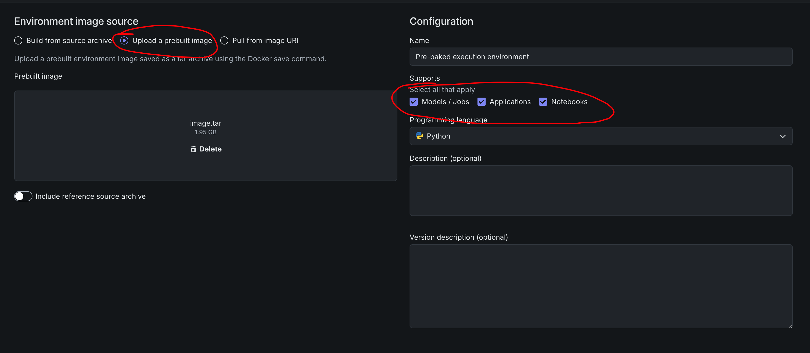

# DataRobot Execution Environment Builder

Build Codespace-ready execution environment Docker contexts for DataRobot App Framework recipes. Uses a **customer-buildable Wolfi base** with Python 3.12 and pre-warmed shared **uv**, **npm**, and **Go** dependency caches.

## Install

```bash
uv tool install -e .
```

## Make an execution environment

1. Generate the Docker context from your App Framework recipe:

```bash
dr environment recipe --recipe-path datarobot-agent-application
```

This writes `docker_context/` in the current working directory (and `agent/docker_context.tar.gz` unless you pass `--no-tarball`).

2. Change into the generated context:

```bash
cd docker_context
```

3. Build the image for **linux/amd64** (required for DataRobot notebook kernels):

```bash
docker build --platform linux/amd64 -t exec-env .
```

On Apple Silicon, always pass `--platform linux/amd64`. An arm64 image fails at runtime with `exec format error` on `start_server.sh`.

4. Export the image to a tarball:

```bash
docker image save exec-env -o image.tar
```

5. Upload `image.tar` as a custom execution environment in DataRobot:



## Usage reference

```bash
dr environment recipe --recipe-path /path/to/datarobot-agent-application
```

Defaults:

- Output: `docker_context/` in the current working directory
- Archive: `agent/docker_context.tar.gz`
- Versions: `.datarobot/cli/versions.yaml`

### Options

```bash
dr environment recipe --recipe-path . --no-tarball
```

## What it produces

```
docker_context/
├── Dockerfile                 # assembled from dockerfile.d/*
├── dockerfile.d/
├── kernel/requirements.txt    # kernel-only deps (no root pyproject.toml)
├── components/<name>/         # copied manifests per recipe component
├── setup-caches.sh
└── ...                        # drop-in entrypoint scripts
```

## Lockfile policy

Build **fails** if a component has:

- `pyproject.toml` without `uv.lock` (fix: `uv lock`)
- `package.json` without `package-lock.json` (fix: `npm install`)
- `go.mod` without `go.sum` (fix: `go mod tidy`)
- Stale lockfiles (`uv lock --check`, `npm ci --dry-run`, or `go mod verify` failure)

## Runtime cache behavior

The Dockerfile sets tool-native env vars:

- `UV_CACHE_DIR=/opt/cache/uv`
- `NPM_CONFIG_CACHE=/opt/cache/npm`
- `NPM_CONFIG_PREFER_OFFLINE=true`
- `GOMODCACHE` / `GOCACHE`

Per-component cache stages run `uv sync --frozen --no-install-project` against each `uv.lock` so runtime `uv sync --offline` can resolve lockfile wheels (including platform-specific builds like `litellm`).

The Dockerfile always sets strict offline env vars (`UV_OFFLINE=1`, `NPM_CONFIG_OFFLINE=true`, `GOPROXY=off`) in addition to shared cache paths. `NOTEBOOKS_AIR_GAP=1` in `setup-caches.sh` applies the same overrides for login shells.

## Component hooks

If a component Taskfile defines an `environment` task, `dr environment recipe` runs it with:

| Variable | Purpose |
|----------|---------|
| `DOCKER_CONTEXT` | Output docker context path |
| `COMPONENT_DIR` | Source component directory |
| `COMPONENT_NAME` | Component name |
| `DOCKERFILE_FRAGMENT` | Path to append cache stage fragment |
| `COMPONENT_DEST` | `components/<name>/` in docker context |

## Development

```bash
uv pip install -e ".[dev]"
pytest
dr-environment --dr-plugin-manifest
```

See [PLUGIN_TESTING.md](PLUGIN_TESTING.md).
